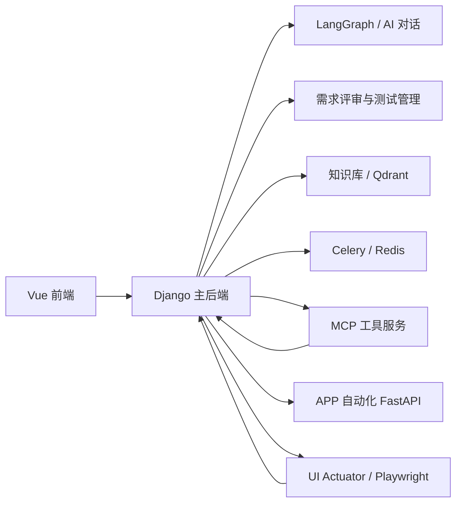

# FlyTest

面向测试团队的 AI-Native 智能测试平台。  
FlyTest 把需求评审、知识检索、测试设计、测试资产管理、Web/UI/APP 自动化和执行反馈串成一条完整链路，帮助团队更快地产出高质量测试用例，并把经验沉淀成可复用的知识与技能。

中文 | [English](README_EN.md)

## 项目定位

FlyTest 不是单一的“AI 生成测试用例”工具，而是一套完整的测试工作台：

- 用 AI 理解需求和上下文
- 用知识库补充项目规则和业务约束
- 生成、保存、评审和优化测试用例
- 管理 API、UI、APP 自动化资产
- 通过 MCP 与 Skills 扩展工具能力
- 用执行器和自动化服务把设计落到执行

## 核心能力

### 1. 需求管理与需求评审

- 上传需求文档，支持文件上传和直接录入
- 文档拆分、模块化整理、评审报告查看
- 多维度需求评审：完整性、一致性、可测性、可行性、清晰度、逻辑性
- 模块级问题、建议、总结和评审结果沉淀

### 2. AI 对话与测试设计

- 基于 LangGraph 的对话式测试设计
- 支持项目上下文、提示词、知识库、Skills、工具调用
- 支持流式响应、会话历史、提示词切换和工具审批
- 生成测试用例后可直接保存到测试管理模块

### 3. 测试资产管理

- 项目管理、成员管理、权限控制
- 测试用例、测试套件、执行历史管理
- 测试模板管理
- 用例支持等级、前置条件、步骤、备注、审核状态、测试类型等字段

### 4. 知识库与上下文增强

- 创建项目级知识库
- 上传文档、切片、向量化、检索与结果回溯
- 为 AI 对话、需求评审、测试设计提供上下文增强
- 支持 Qdrant 向量存储

### 5. 自动化测试能力

- API 自动化：请求管理、测试用例、环境配置、执行记录、测试报告
- UI 自动化：页面、步骤、执行记录、Trace、AI 智能模式
- APP 自动化：设备、应用包、元素、场景编排、测试用例、执行记录、报告

### 6. MCP 与 Skills 扩展

- 支持 MCP 远程配置与工具接入
- 内置 FlyTest 工具、Playwright MCP 工具链
- 支持项目 Skills 管理与仓库内置 Skills 回退
- 可通过工具调用执行 FlyTest 用例管理、截图上传、图表处理等动作

## 仓库结构

| 目录 | 说明 |
| --- | --- |
| `FlyTest_Django/` | 主后端，Django REST Framework + Channels + LangGraph |
| `FlyTest_Vue/` | 前端应用，Vue 3 + TypeScript + Vite + Arco Design |
| `FlyTest_FastAPI_AppAutomation/` | APP 自动化独立 FastAPI 服务 |
| `FlyTest_Actuator/` | UI 自动化执行器，通过 WebSocket 接收任务并驱动 Playwright |
| `FlyTest_MCP/` | MCP 工具服务，包含 FlyTest Tools 和其他工具入口 |
| `FlyTest_Skills/` | 内置 Skills 仓库 |
| `docs/` | 项目文档与 VitePress 站点内容 |
| `deploy-scripts/` | 文档和部署辅助脚本 |
| `data/` | 本地运行数据目录 |

## 技术栈

### 前端

- Vue 3
- TypeScript
- Vite
- Pinia
- Arco Design Vue

### 后端

- Django 5
- Django REST Framework
- Channels / Daphne
- SimpleJWT
- Celery + Redis
- LangChain / LangGraph

### AI 与知识增强

- OpenAI 兼容模型接入
- Qwen Provider 支持
- Qdrant
- FastEmbed / 向量检索链路

### 自动化与扩展

- Playwright
- FastAPI
- MCP
- Skills Runtime / Bundled Skills

## 系统架构



## 典型使用流程

1. 创建项目并配置成员权限
2. 上传需求文档并完成需求拆分
3. 发起需求评审，查看专项报告与模块结果
4. 进入 AI 对话，结合需求、提示词和知识库生成测试用例
5. 将生成结果保存到测试用例模块
6. 在 API / UI / APP 自动化模块中继续编排和执行
7. 查看执行记录、报告和 Trace，持续优化测试资产

## 快速开始

### 方式一：Docker Compose

适合快速体验完整能力。

```bash
git clone https://github.com/weixiaoluan/flytest.git
cd flytest
cp .env.example .env
docker compose up -d
```

默认访问地址：

- 前端：`http://localhost:8913`
- 后端 API：`http://localhost:8912`
- MCP：`http://localhost:8914`
- Playwright MCP：`http://localhost:8916`
- Qdrant：`http://localhost:8918`
- PostgreSQL：`localhost:8919`

默认后台账号：

- 用户名：`admin`
- 密码：`admin123456`

### 方式二：本地开发

#### 1. 启动 Django 后端

```bash
cd FlyTest_Django
python -m venv .venv
.venv\Scripts\activate
pip install -r requirements.txt
python manage.py migrate
python manage.py runserver 0.0.0.0:8000
```

#### 2. 启动 Vue 前端

```bash
cd FlyTest_Vue
npm install
npm run dev -- --host 0.0.0.0 --port 5173
```

#### 3. 启动 APP 自动化服务

```bash
cd FlyTest_FastAPI_AppAutomation
python -m pip install -r requirements.txt
python -m uvicorn app.main:app --host 0.0.0.0 --port 8010 --reload
```

#### 4. 启动 MCP 工具服务

```bash
cd FlyTest_MCP
pip install -r requirements.txt
python FlyTest_tools.py
```

#### 5. 启动 UI 执行器

```bash
cd FlyTest_Actuator
pip install -r requirements.txt
python main.py
```

## 关键配置

常见环境变量：

- `DATABASE_TYPE`：`postgres` 或 `sqlite`
- `POSTGRES_HOST` / `POSTGRES_DB` / `POSTGRES_USER` / `POSTGRES_PASSWORD`
- `CELERY_BROKER_URL`
- `CELERY_RESULT_BACKEND`
- `DJANGO_SECRET_KEY`
- `DJANGO_ALLOWED_HOSTS`
- `DJANGO_CORS_ALLOWED_ORIGINS`
- `FLYTEST_API_KEY`
- `FLYTEST_BACKEND_URL`
- `QDRANT_URL`
- `MEDIA_ROOT`

建议从根目录 `.env.example` 开始配置。

## 文档与说明

- 快速启动指南：[`docs/QUICK_START.md`](./docs/QUICK_START.md)
- Docker / 部署配置：[`docker-compose.yml`](./docker-compose.yml)
- 后端说明：[`FlyTest_Django/README.md`](./FlyTest_Django/README.md)
- 前端说明：[`FlyTest_Vue/README.md`](./FlyTest_Vue/README.md)
- APP 自动化服务：[`FlyTest_FastAPI_AppAutomation/README.md`](./FlyTest_FastAPI_AppAutomation/README.md)
- UI 执行器：[`FlyTest_Actuator/README.md`](./FlyTest_Actuator/README.md)
- MCP 工具服务：[`FlyTest_MCP/README.md`](./FlyTest_MCP/README.md)

## 安全建议

- 默认配置仅适合本地开发或受控内网环境
- 生产环境请务必更换默认管理员密码和 API Key
- 对 MCP、Skills、执行器等高权限能力启用最小权限原则
- 对外暴露服务前请补齐访问控制、密钥管理、跨域与网关策略

## 许可证

本项目采用 [LICENSE](./LICENSE) 中定义的许可证。

## 致谢

感谢以下开源生态为 FlyTest 提供基础能力：

- Django / Django REST Framework
- Vue / Vite / Pinia
- LangChain / LangGraph
- Qdrant
- Playwright
- FastAPI
- Arco Design
