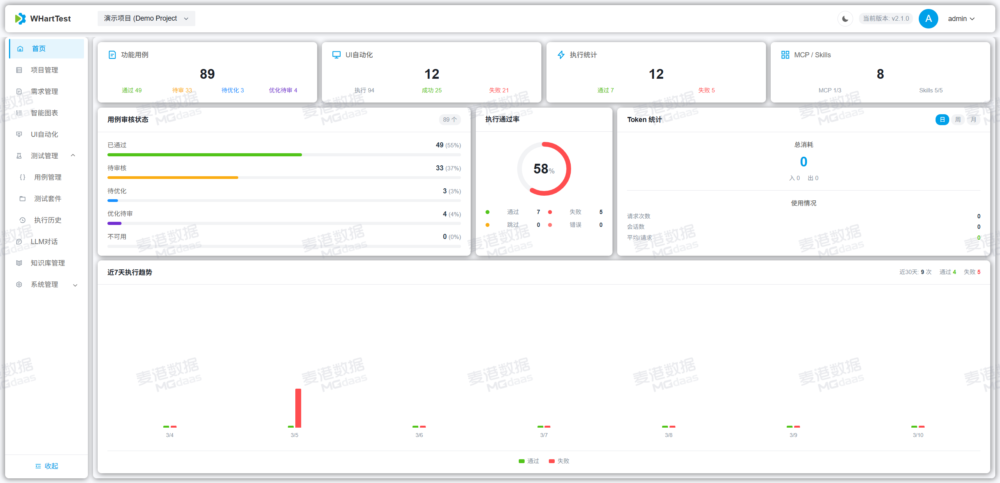
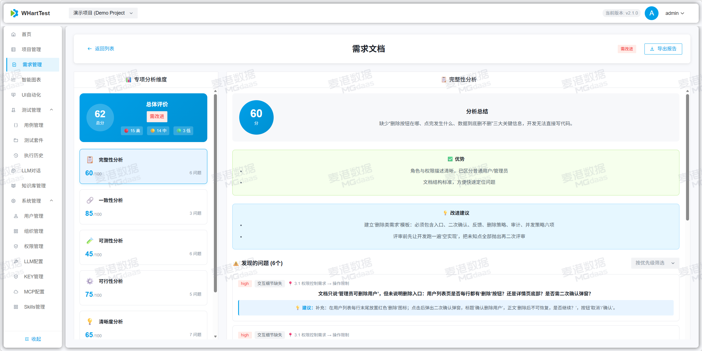
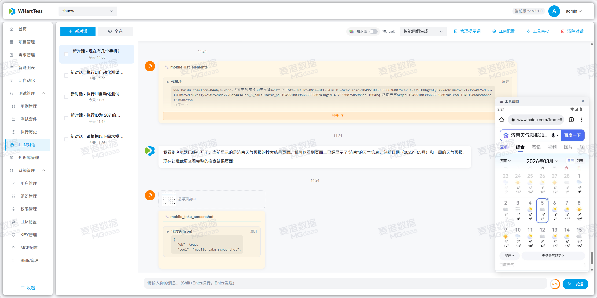
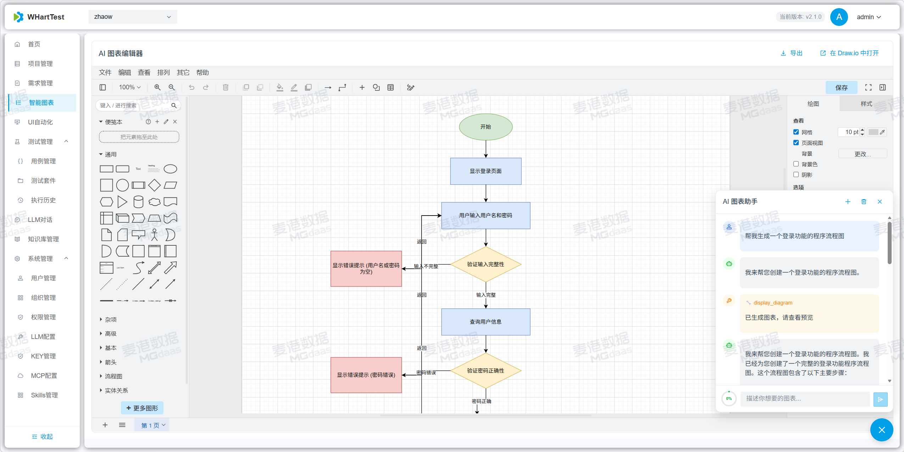
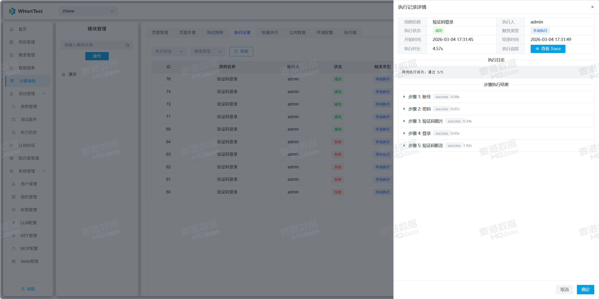
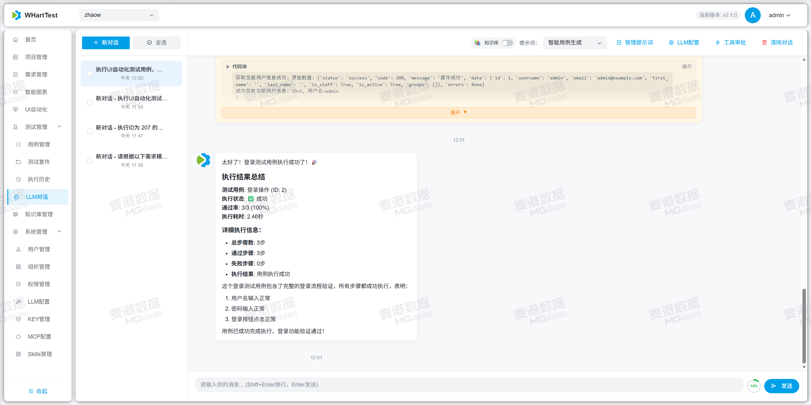
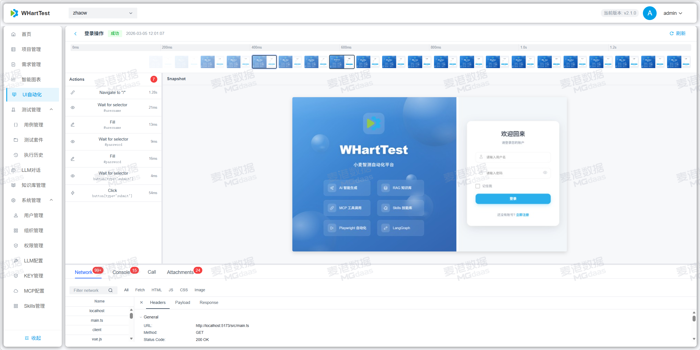
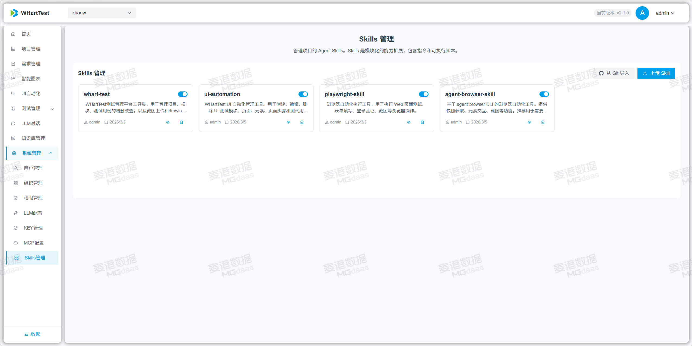

# FlyTest - 智能测试平台

中文 | [English](README_EN.md)

## 项目简介

FlyTest 是一套面向测试团队的 AI-Native 智能测试平台，覆盖需求理解、知识沉淀、测试设计、自动化执行与结果追踪的完整链路。平台基于 Django REST Framework 与 Vue 3 构建，结合 LangGraph、RAG、MCP、Playwright 等能力，帮助团队更快地构建高质量测试资产，并提升协作效率与执行效率。

## 核心能力

- AI生成用例：基于需求、对话、接口文档和项目上下文，自动生成结构化测试用例。
- RAG知识库：支持多格式文档解析、向量检索与重排，为生成和问答提供更准确的上下文。
- openclaw：作为平台内嵌智能能力扩展入口，增强复杂任务理解、工具协同与自动化编排。
- Skills技能库：支持标准化技能导入、管理与复用，持续沉淀团队测试经验。
- API自动化：支持接口用例组织、测试资产沉淀与 AI 辅助生成。
- UI自动化：基于 Playwright 提供低代码 UI 自动化能力，支持页面操作、断言、截图、Trace 与执行记录。
- APP自动化：集成移动端自动化能力，支持 Android、iOS 场景下的设备与应用操作。
- AI渗透测试：结合 AI 扩展安全测试思路，用于识别潜在攻击面、风险路径与薄弱环节。
- LangGraph：支持多阶段智能工作流编排，把生成、分析、执行与反馈连接成可持续演进的测试闭环。
- 需求评审与测试管理：支持需求评审、项目管理、测试用例管理、测试套件与执行结果分析。

## 技术架构

- 后端：Django REST Framework、Channels、SimpleJWT、LangChain、LangGraph
- 前端：Vue 3、Vite、Pinia、Arco Design
- 自动化执行：Playwright、UI Actuator、MCP 工具链
- 知识能力：向量检索、Reranker、多模型接入

## 适用场景

- 基于需求快速生成测试用例
- 建立项目级测试知识库与 AI 问答能力
- 统一管理 API、UI、APP 自动化测试资产
- 通过智能工作流提升测试设计与执行效率
- 在研发测试协作过程中沉淀可复用的技能与流程

## 快速开始

### Docker 部署

```bash
git clone https://github.com/weixiaoluan/flytest.git
cd flytest
cp .env.example .env
docker compose up -d
```

启动后默认访问：

- 前端：http://localhost:8913

默认账号：

- 用户名：`admin`
- 密码：`admin123456`

## 文档

- 在线文档：https://mgdaaslab.github.io/FlyTest/
- 快速启动指南：[docs/QUICK_START.md](./docs/QUICK_START.md)
- GitHub 自动构建部署指南：[docs/github-docker-deployment.md](./docs/github-docker-deployment.md)

## 页面展示

| | |
|---|---|
|  |  |
|  |  |
|  |  |
|  |  |
|  |  |
|  |  |
|  |  |
|  |  |

## 贡献指南

1. Fork 项目
2. 创建功能分支
3. 提交代码变更
4. 发起 Pull Request

## 安全说明

- 建议仅在内网或受信任网络中部署。
- 不建议将服务直接暴露到公网，尤其是在未完成认证、权限与密钥治理时。
- 涉及 Skills、MCP、自动化执行器等高权限能力时，请优先采用最小权限原则。

**FlyTest** - 让测试设计更智能，让测试执行更高效。
